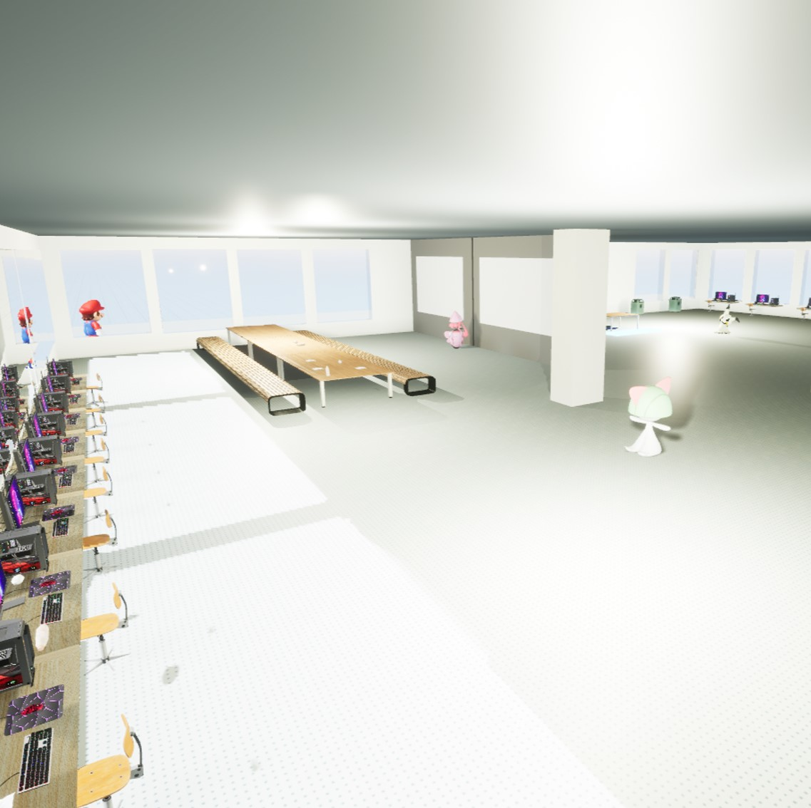
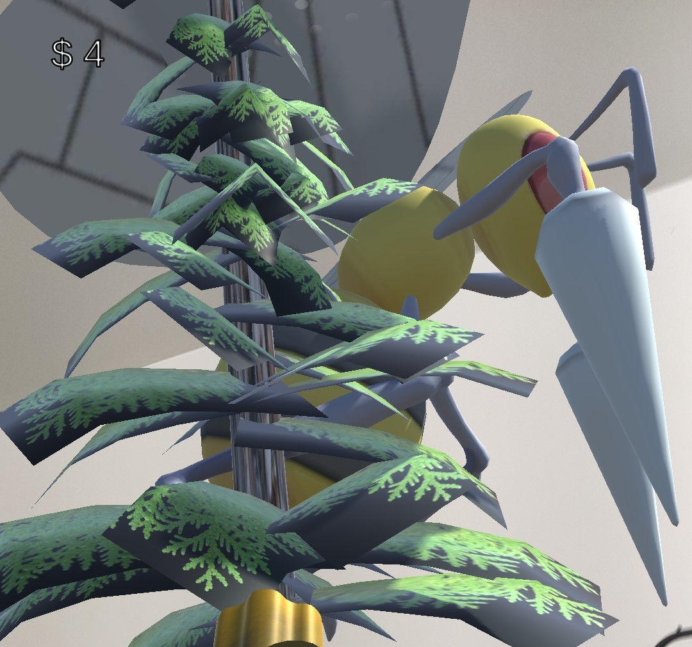

# XR projects

## Project 1
A VR project that simulate the CSE building.

[Learn more](https://drive.google.com/file/d/1g-xUIm530ypMFkjll02E3rPawakQzaxw/view?usp=sharing)

## Project 2
An AR project that plant trees and fight with enemies inside Ann Arbor. Use mapbox for the GPS locating.

[Learn More](https://drive.google.com/file/d/16D_MePnuCfGZUyNxLk7_OKmSRGEXBEpN/view?usp=sharing)