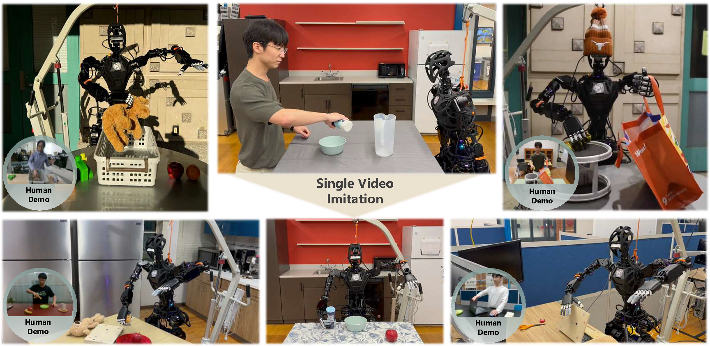

# OKAMI: Teaching Humanoid Robots Manipulation Skills through Single Video Imitation

[[Website]](https://ut-austin-rpl.github.io/OKAMI/)
[[Arxiv]](https://arxiv.org/abs/2410.11792)
______________________________________________________________________

