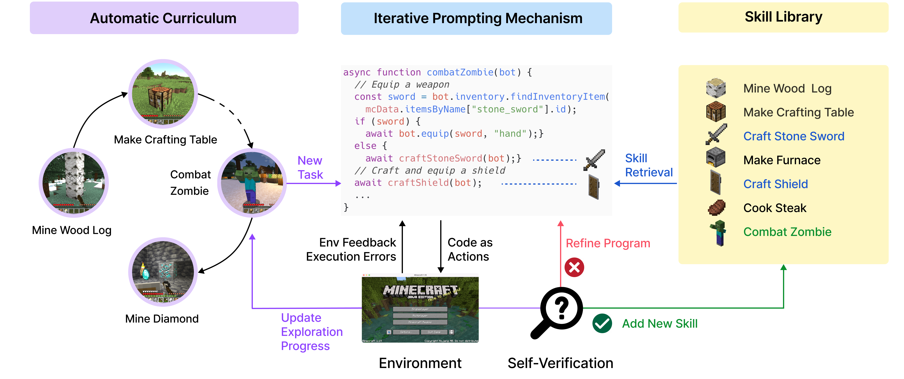
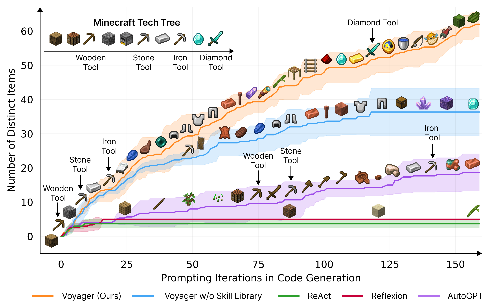

# Voyager: An Open-Ended Embodied Agent with Large Language Models

[[Website]](https://voyager.minedojo.org/)
[[Arxiv]](https://arxiv.org/abs/2305.16291)
[[PDF]](https://voyager.minedojo.org/assets/documents/voyager.pdf)
[[Tweet]](https://twitter.com/DrJimFan/status/1662115266933972993?s=20)

______________________________________________________________________

